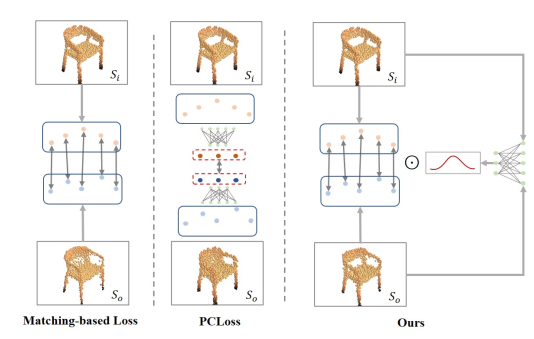








My name is Qingyao Liu (刘青瑶). Now, I'm applying for a Ph.D. position. After obtaining my master's degree, I worked for a year as an Autonomous Driving Algorithm Engineer at [Li Auto](https://www.lixiang.com/en/tech/autodrive?rt=95727506#li). In 2023, I earned an M.Eng. in Electronic Information from [Zhejiang University](http://www.zju.edu.cn/english/) (ZJU), under the supervision of [Prof. Yong Liu](https://april.zju.edu.cn/team/dr-yong-liu/) in [APRIL Lab](https://april.zju.edu.cn/). Prior to that, I received a B.Eng. in Automation from [Wuhan University](https://en.whu.edu.cn/) (WHU) in 2020. 

My research interests include Computer Vision, Scene Reconstruction, Robotics, and SLAM.

<!-- My research interest includes neural machine translation and computer vision. I have published more than 100 papers at the top international AI conferences with total <a href='https://scholar.google.com/citations?user=DhtAFkwAAAAJ'>google scholar citations <strong>260000+</strong></a> (You can also use google scholar badge ). -->

# 🔥 News
- *Jun. 2024*: &nbsp;🎉 One paper is accepted by IROS 2024.
- *Jun. 2023*: &nbsp; I joined Li Auto as an Autonomous Driving Algorithm Engineer.

# 📝 Publications 
(* indicates equal contribution)

IROS 2024

CSR: A Lightweight Crowdsourced Road Structure Reconstruction System for Autonomous Driving

Huayou Wang\*, **Qingyao Liu\***, Jiazheng Wu, Kun Liu, Chao Ding, Changliang Xue.

_IEEE/RSJ International Conference on Intelligent Robots and Systems (**IROS**), 2024_

[Paper](https://ieeexplore.ieee.org/document/10801299)
<!-- The paper has been accepted and will be published soon. | <a href="../images/papers/CSR.pdf" target="_blank"> Paper</a> -->

PRL

Learnable Chamfer Distance for Point Cloud Reconstruction

[Tianxin Huang](https://tianxinhuang.github.io/), **Qingyao Liu**, Xiangrui Zhao, Jun Chen, Yong Liu.

_Pattern Recognition Letters (**PRL**), 2024_

<!-- <a href="../images/papers/LCD.pdf" target="_blank"> PDF</a> -->
[arXiv](https://arxiv.org/abs/2312.16582) | [Code](https://github.com/Tianxinhuang/LCDNet)

<!-- - [Lorem ipsum dolor sit amet, consectetur adipiscing elit. Vivamus ornare aliquet ipsum, ac tempus justo dapibus sit amet](https://github.com), A, B, C, **CVPR 2020** -->

# 🎖 Honors and Awards
- 2021, Academic Scholarship - Zhejiang University
- 2020, Outstanding Graduate Award - Wuhan University. 
- 2019, The 14th National Smart Car Competition for College Students - **Champion**. / [video](../video/finals.mp4)
- 2018, Outstanding Student Award & Scholarship - Wuhan University.
- 2017, Outstanding Student Award & Scholarship - Wuhan University.

# 📖 Education and Work
- Jun. 2023 - Jun. 2024, Beijing, China, Full-time Job, Autonomous Driving Algorithm Engineer, [Li Auto](https://www.lixiang.com/en/tech/autodrive?rt=95727506#li).
- Jun. 2022 - Sep. 2022, Suzhou, China, Internship, AI Algorithms Intern, [Zhijia Technology](https://www.smartxtruck.com/technology.html).
- Sep. 2020 - Mar. 2023, Hangzhou, China, M.Eng., Zhejiang University (ZJU). 
- Sep. 2016 - Jun. 2020, Wuhan, China, B.Eng., Wuhan University (WHU).
