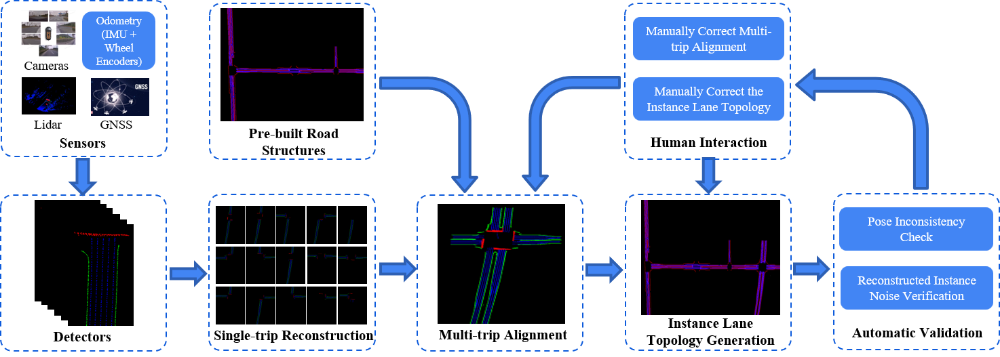








My name is Qingyao Liu (刘青瑶). After obtaining my master's degree, I worked for a year as an Autonomous Driving Algorithm Engineer at [Li Auto](https://www.lixiang.com/en/tech/autodrive?rt=95727506#li). In 2023, I earned an M.Eng. in Electronic Information from Zhejiang University, under the supervision of [Prof. Yong Liu](https://april.zju.edu.cn/team/dr-yong-liu/) in [APRIL Lab](https://april.zju.edu.cn/). Prior to that, I received a B.Eng. in Automation from Wuhan University in 2016. 

My research interests include 3D Vision, 3D Reconstruction, Robotics, and SLAM.

<!-- My research interest includes neural machine translation and computer vision. I have published more than 100 papers at the top international AI conferences with total <a href='https://scholar.google.com/citations?user=DhtAFkwAAAAJ'>google scholar citations <strong>260000+</strong></a> (You can also use google scholar badge ). -->

# 🔥 News
- *2024.06*: &nbsp;🎉 One paper is accepted by IROS 2024.
- *2023.06*: &nbsp; I joined Li Auto as an Autonomous Driving Algorithm Engineer.

# 📝 Publications 
(* indicates equal contribution)

IROS 2024

CSR: A Lightweight Crowdsourced Road Structure Reconstruction System for Autonomous Driving

Huayou Wang\*, **Qingyao Liu\***, et al.

_IEEE/RSJ International Conference on Intelligent Robots and Systems (IROS), 2024_

The paper has been accepted and will be published soon. | <a href="../images/IROS2024/CSR.pdf" target="_blank"> PDF</a>

<!-- [**Project**](https://scholar.google.com/citations?view_op=view_citation&hl=zh-CN&user=DhtAFkwAAAAJ&citation_for_view=DhtAFkwAAAAJ:ALROH1vI_8AC) <strong></strong>
- Lorem ipsum dolor sit amet, consectetur adipiscing elit. Vivamus ornare aliquet ipsum, ac tempus justo dapibus sit amet. 

 -->

---

- [Learnable Chamfer Distance for Point Cloud Reconstruction](https://arxiv.org/abs/2312.16582), Tianxin Huang, **Qingyao Liu**, Xiangrui Zhao, Jun Chen, Yong Liu. ``Pattern Recognition Letters`` \| [Code](https://github.com/Tianxinhuang/LCDNet)

<!-- - [Lorem ipsum dolor sit amet, consectetur adipiscing elit. Vivamus ornare aliquet ipsum, ac tempus justo dapibus sit amet](https://github.com), A, B, C, **CVPR 2020** -->

# 🎖 Honors and Awards
- *2021* Academic Scholarship - Zhejiang University
- *2020* Outstanding Graduate Award from Wuhan University. 
- *2019* The 14th National Smart Car Competition for College Students - **Champion**. / [video](../video/finals.mp4)
- *2016-2018* Outstanding Student Award & Scholarship from Wuhan University.

# 📖 Educations
- *2020.09 - 2023.03*, M.Eng., Zhejiang University, Hangzhou, China. 
- *2016.09 - 2020.06*, B.Eng., Wuhan University, Wuhan, China.

<!-- # 💬 Invited Talks
- *2021.06*, Lorem ipsum dolor sit amet, consectetur adipiscing elit. Vivamus ornare aliquet ipsum, ac tempus justo dapibus sit amet. 
- *2021.03*, Lorem ipsum dolor sit amet, consectetur adipiscing elit. Vivamus ornare aliquet ipsum, ac tempus justo dapibus sit amet.  \| [\[video\]](https://github.com/) -->

# 💻 Internships
- *2022.06 - 2022.09*, [Plus](https://www.smartxtruck.com/technology.html), Suzhou, China.

  Last updated on: {{ page.last_modified_at | date: "%B %d, %Y" }}

